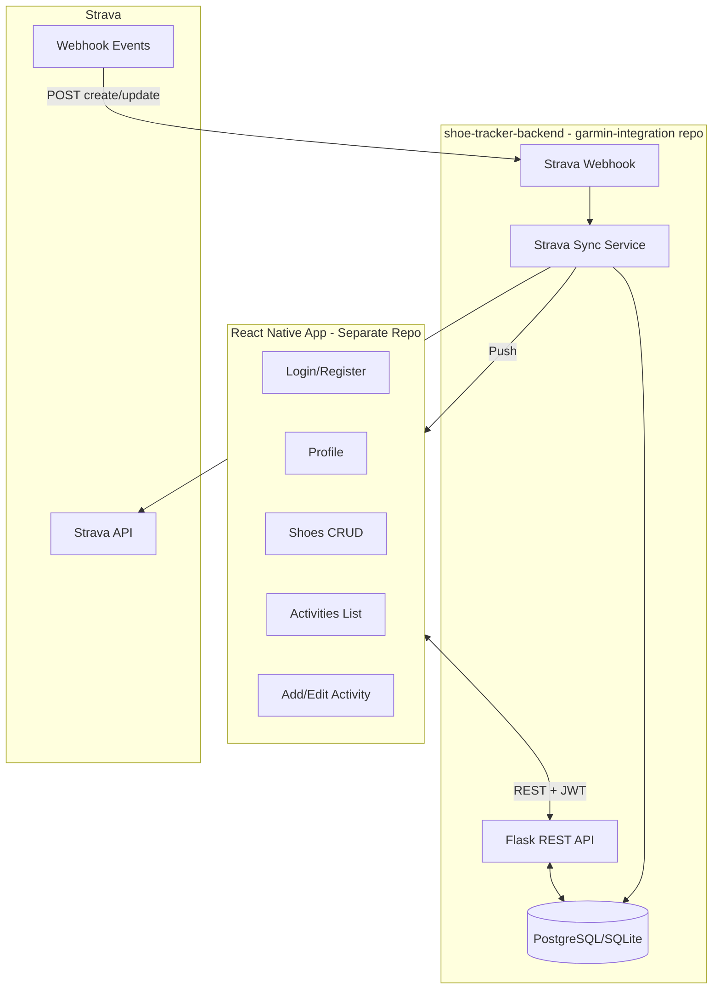

# Shoe Tracker App - Development Plan

## Overview

Build a running shoe mileage tracker with a Python backend in the garmin-integration repo (reusing FIT analyzers) and a separate React Native app. Users manage shoes, log activities with per-shoe distances, connect Strava for auto-import, and receive push notifications when new activities arrive.

## Architecture



---

## 1. Backend (New Subfolder in garmin-integration Repo)

**Location:** `garmin-integration/shoe-tracker-backend/`

### 1.1 Project Structure

```
shoe-tracker-backend/
├── src/
│   ├── api/
│   │   └── app.py              # Flask app, routes
│   ├── models/                 # SQLAlchemy or raw SQL
│   ├── services/
│   │   ├── strava_service.py   # OAuth, API calls, token refresh
│   │   └── webhook_handler.py  # Strava webhook processing
│   ├── strava_connector.py     # Strava API client (similar pattern to garmin_connector)
│   └── config.py
├── migrations/                 # Alembic or manual
├── requirements.txt
└── run.sh
```

**Reuse from existing backend:** Import `fit_reader`, `activity_zone_extractor`, `heart_zone_analyzer` from `../backend/src/` (or add shared package). For MVP Strava import we use activity summary only (distance, name, date). For future FIT/interval analysis: Strava provides streams (heartrate, time, distance) - we can build an adapter that converts streams to DataFrame format compatible with existing analyzers (Strava has no direct FIT download).

### 1.2 Data Model

| Table | Key Fields |
| ----- | ---------- |
| **users** | id, email, password_hash, name, avatar_url, created_at |
| **users_strava** | user_id, strava_athlete_id, access_token, refresh_token, token_expires_at |
| **shoes** | id, user_id, activity_type, brand, model, nick, max_distance_km, is_default, created_at |
| **activities** | id, user_id, name, date, total_distance_km, source (manual \| strava), strava_activity_id |
| **activity_shoes** | id, activity_id, shoe_id, distance_km |

### 1.3 API Endpoints

| Method | Endpoint | Auth | Purpose |
| ------ | -------- | ---- | ------- |
| POST | /api/auth/register | No | Register user |
| POST | /api/auth/login | No | Login, return JWT |
| POST | /api/auth/forgot-password | No | Request reset |
| POST | /api/auth/reset-password | No | Reset with token |
| GET | /api/auth/me | Yes | Current user |
| PUT | /api/auth/profile | Yes | Update name, avatar |
| CRUD | /api/shoes | Yes | List, create, update, delete shoes |
| PUT | /api/shoes/:id/default | Yes | Mark shoe as default |
| CRUD | /api/activities | Yes | List, create, update, delete activities |
| GET | /api/activities/:id | Yes | Activity detail with shoes |
| PUT | /api/activities/:id/shoes | Yes | Add/edit/remove shoes and distances |
| GET | /api/strava/connect | Yes | Return Strava OAuth URL |
| GET | /api/strava/callback | No | OAuth callback, exchange code, store tokens |
| POST | /api/strava/disconnect | Yes | Remove Strava link |
| GET | /api/strava/status | Yes | Connected or not |
| POST | /api/webhooks/strava | No | Strava webhook receiver (validate, respond 200, async process) |

### 1.4 Strava Integration Flow

1. **Connect:** User taps "Connect Strava" -> redirect to Strava OAuth -> callback saves tokens and `strava_athlete_id` for user.
2. **Webhook subscription:** On first Strava connect, backend creates a single webhook subscription (one per app). Callback URL must be publicly reachable (ngrok for dev, real domain for prod).
3. **Webhook handler:** On `aspect_type=create`, `object_type=activity`:
   - Look up user by `owner_id` (Strava athlete ID).
   - Fetch activity via Strava API (`GET /activities/{object_id}`).
   - If `sport_type` indicates running (e.g. Run, VirtualRun), create activity in DB with default shoe, set distance from `distance` (meters -> km).
   - Enqueue push notification (Expo Push Token stored in users table).
   - Return 200 within 2 seconds; heavy work runs async.

### 1.5 Auth and Tech Choices

- **Auth:** JWT (access + optional refresh). Store user id in JWT.
- **Database:** SQLite for dev/simple deploy; PostgreSQL for production (env-switchable).
- **Password:** bcrypt for hashing. Reset flow: random token in DB, email link (or in-app deep link with token).

---

## 2. React Native App (Separate Repo)

**Location:** New repository (e.g. `shoe-tracker-app`)

### 2.1 Tech Stack

- **Expo** (managed workflow) for easier push notifications and OTA.
- **React Navigation** for screens.
- **AsyncStorage** for JWT.
- **Expo Notifications** for push (Expo Push Token sent to backend on login).
- **Deep linking:** `shoe-tracker://activity/:id/edit` for "open in edit" from notification.

### 2.2 Screens and Navigation

| Screen | Route | Purpose |
| ------ | ----- | ------- |
| Login | /login | Email/password login |
| Register | /register | Email/password signup |
| Profile | /profile | Avatar, name, email, reset password, Strava connect status |
| Shoes | /shoes | List shoes, add shoe (activity type, brand, model, nick, max distance) |
| Add Shoe | /shoes/add | Form for new shoe |
| Activities | /activities | List activities, FAB "Add activity" |
| Add Activity | /activities/add | Name, date, add shoes, total distance, per-shoe distance |
| Activity Detail | /activities/:id | View shoes in activity; tap to edit |
| Edit Activity | /activities/:id/edit | Add/remove shoes, edit distances |

### 2.3 Key UX Flows

**Add activity (manual):**
- Name, date picker, total distance.
- Add shoes: pick from user's shoes, set distance per pair. Sum of shoe distances can differ from total (user responsibility or soft validation).
- Default shoe pre-selected with full distance; user can add more shoes and split.

**Add activity (from Strava):**
- Webhook creates activity with default shoe.
- Push notification: "New run from Strava: X km. Tap to edit shoes."
- Tap opens `/activities/:id/edit` (via deep link).

**Profile:**
- Avatar (camera/gallery), name, email (read-only), "Reset password", "Connect Strava" / "Disconnect Strava".

---

## 3. Strava Webhook Setup

- **Callback URL:** Must be HTTPS and publicly reachable (e.g. `https://api.yourdomain.com/api/webhooks/strava`).
- **Verification:** On subscription create, Strava sends `GET callback_url?hub.challenge=X&hub.verify_token=Y`. Respond with `{"hub.challenge": "X"}` and 200.
- **Event handling:** Respond 200 immediately; process in background (queue or thread).

### 3.1 Strava OAuth App Setup

- Use [Strava Developers](https://developers.strava.com) to create a Connected App and copy the generated `Client ID`/`Client Secret`.
- Set the **Authorization Callback Domain** to your frontend host (for example `localhost:5173`) and add a redirect URI that points to the new UI page (`https://<frontend_url>/strava/oauth`). The React page parses the `code` and posts it to `/api/strava/callback`.
- Alternatively, Strava can redirect to a backend-only endpoint (e.g. `https://<backend_url>/api/strava/callback`) and that handler can immediately forward the user to the UI after exchanging the code.
- Choose a random `STRAVA_WEBHOOK_VERIFY_TOKEN` and register it with the webhook so the backend can validate incoming challenges.
- Optional: adjust `STRAVA_SCOPE` (defaults to `activity:read_all,activity:write`) if you need more granular permissions.

---

## 4. Implementation Order

### Phase 1: Backend Core

1. Create `shoe-tracker-backend/` structure, Flask app, config.
2. Implement users table, register/login, JWT auth.
3. Shoes CRUD, activities CRUD, activity_shoes.
4. Profile endpoints (update name, avatar, reset password).

### Phase 2: React Native Core

1. Expo init, navigation, API client with JWT.
2. Login/register screens.
3. Profile screen (avatar, name, email, reset password).
4. Shoes list and add shoe.
5. Activities list, add activity (manual), activity detail, edit activity (add/remove shoes, edit distances).

### Phase 3: Strava

1. Strava OAuth (connect, callback, disconnect).
2. Strava connector service, token refresh.
3. Webhook endpoint (verify + handle create).
4. On activity create from Strava: fetch activity, if running -> insert activity with default shoe, enqueue push.

### Phase 4: Push Notifications

1. Expo Notifications setup in RN app.
2. Send Expo Push Token to backend on login; store in users.
3. Backend: on Strava activity import, send push via Expo API.
4. Deep link to activity edit screen.

---

## 5. Environment / Config

**Backend:**
- `DATABASE_URL` (SQLite path or Postgres URL)
- `JWT_SECRET`
- `STRAVA_CLIENT_ID`
- `STRAVA_CLIENT_SECRET`
- `STRAVA_REDIRECT_URI` (must match the redirect registered with Strava, e.g. `https://localhost:5173/strava/oauth`)
- `STRAVA_SCOPE` (optional, defaults to `activity:read_all,activity:write`)
- `STRAVA_WEBHOOK_VERIFY_TOKEN`
- `STRAVA_TOKEN_CACHE_PATH` (optional path to persist the token response; defaults to `backend/.strava_tokens.json`)
- `BACKEND_URL` (used when the frontend or webhooks need to resolve the backend base)
- `STRAVA_FRONTEND_REDIRECT_URL` (where GET callbacks should land after exchanging tokens, e.g. `https://localhost:5173/strava/oauth`)

**React Native:**
- `EXPO_PUBLIC_API_URL` (backend base URL)

---

## 6. Notes

- Strava API has no direct FIT download; activity summary (distance, type, name, date) is used for auto-import. Future interval/shoe prediction can use Strava streams API (heartrate, time, distance) and adapt the output to the existing FIT-derived analyzers.
- One Strava webhook subscription per app covers all connected users.
- Rate limits: Strava 200 req/15min, 2000/day; batch or defer non-critical calls.
